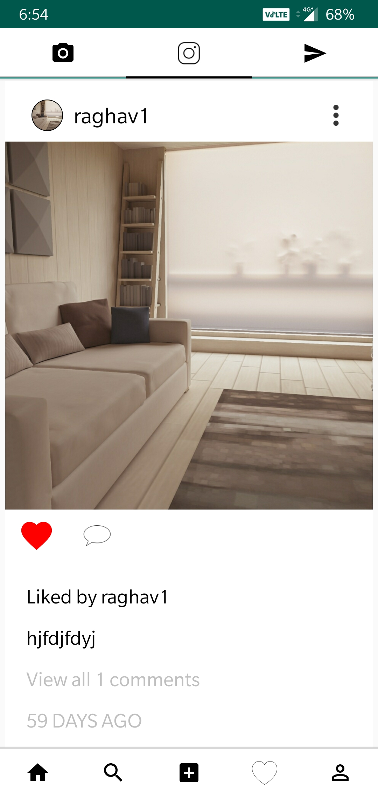
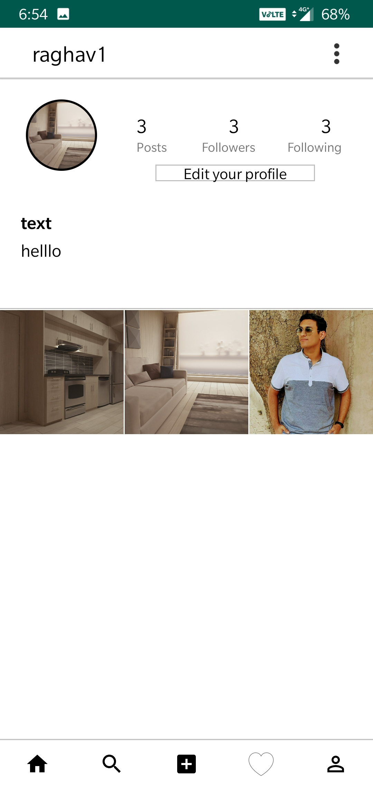
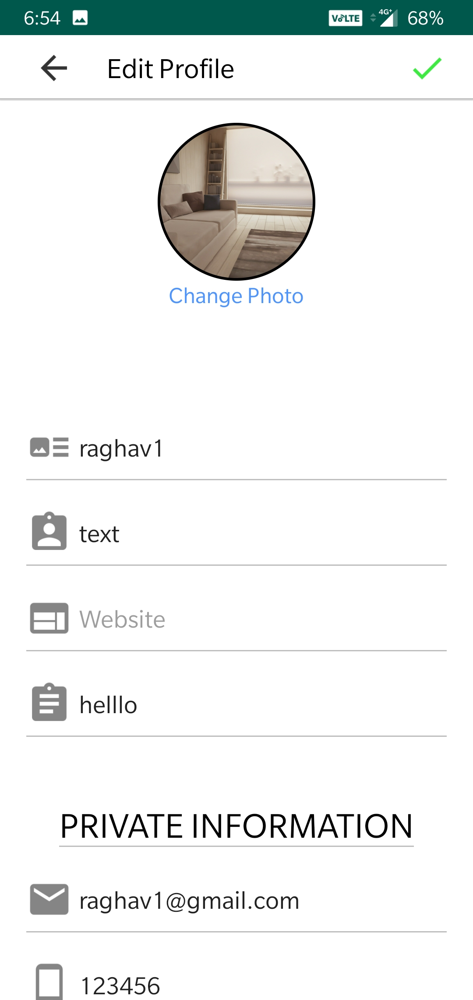
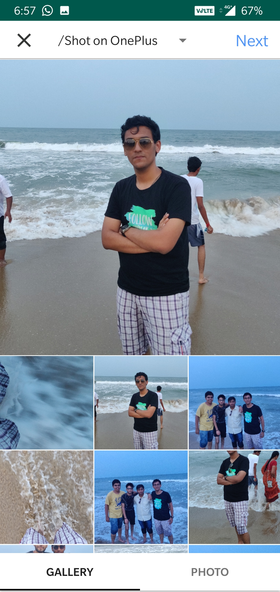
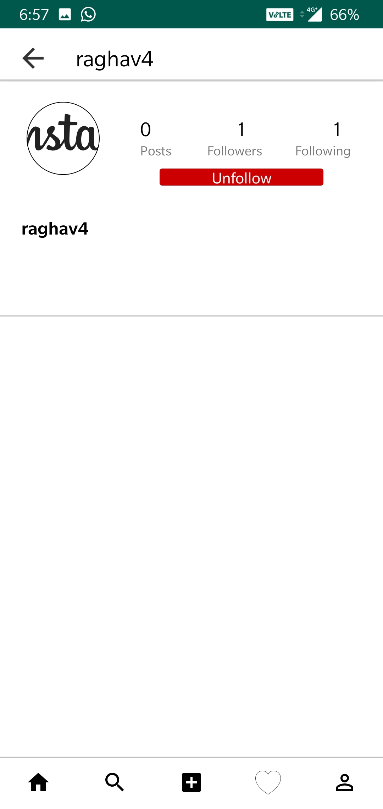
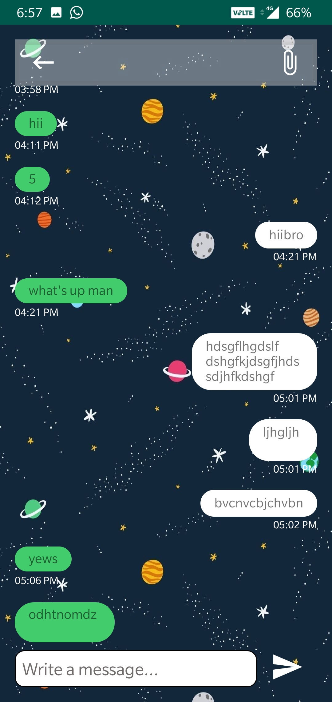

# instaclone
This is an Instagram clone app

Steps to use this:
1. Make an account on firebase and then make a project.
2. Follow the steps given by firebase to connect the project with the app.
3. Add the google-services.json file downloaded to the project.

AND YOU ARE READY TO GO....

FEATURES:
1. Can upload Images just like Instagram using both Gallery and Camera.
2. Can like the Images.
3. Same Followers and Following system like Instagram.
4. Comment on Images.
AND THE BIGGEST OF ALL YOU CAN CHAT WITH THE PEOPLE FOLLOWED LIKE DIRECT MESSAGE.

NOT INCLUDED FEATURES:
1. Instagram Stories.
2. Cannot send Media.

 
 
 
